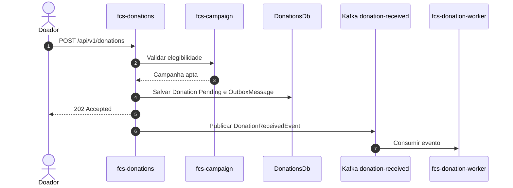

# fcs-donations

API de intenções de doação da plataforma **Conexão Solidária**. Recebe pedidos de um **Doador** autenticado, valida a campanha e publica o processamento assíncrono no Kafka.

## Responsabilidades

- Expor `POST /api/v1/donations` e as consultas de doações do Doador ou GestorONG.
- Validar a elegibilidade da campanha na `fcs-campaign` antes de aceitar a intenção.
- Persistir `Donations`, `OutboxMessages` e `ProcessedMessages` no `DonationsDb`.
- Publicar `DonationReceivedEvent` no tópico `donation-received` por meio da outbox.
- Publicar eventos explícitos no tópico `audit-log-requested`.
- Publicar `EmailNotificationRequestedEvent` para a `fcs-notifications` após criar a doação.

## Referências oficiais

- [Visão geral](https://github.com/group10-tc-01/fcs-fase05-docs/blob/main/architecture/overview.md)
- [Modelo da fcs-donations](https://github.com/group10-tc-01/fcs-fase05-docs/blob/main/architecture/fcs-donations-model.md)
- [Fluxos de endpoints](https://github.com/group10-tc-01/fcs-fase05-docs/blob/main/architecture/endpoint-flows.md)
- [ADR 0006 — Intenções de doação](https://github.com/group10-tc-01/fcs-fase05-docs/blob/main/adr/0006-donations-api-receives-donation-intentions.md)
- [ADR 0007 — Elegibilidade via HTTP](https://github.com/group10-tc-01/fcs-fase05-docs/blob/main/adr/0007-validate-campaign-eligibility-over-http.md)
- [ADR 0008 — Eventos Kafka](https://github.com/group10-tc-01/fcs-fase05-docs/blob/main/adr/0008-use-kafka-for-donation-events.md)

---

## Estrutura do projeto

```text
src/
  Fcs.Donations.Domain/                   # Entidades, regras e resultados de domínio
  Fcs.Donations.Messages/                 # Contratos de mensagens
  Fcs.Donations.Application/              # Casos de uso, validações e abstrações
  Fcs.Donations.Infrastructure.Auth/      # JWT e usuário atual
  Fcs.Donations.Infrastructure.Http/      # Cliente de elegibilidade de campanhas
  Fcs.Donations.Infrastructure.Kafka/     # Outbox e publicação de eventos
  Fcs.Donations.Infrastructure.SqlServer/ # Persistência, migrations e repositórios
  Fcs.Donations.WebApi/                   # Controladores, pipeline e observabilidade
tests/
  Fcs.Donations.CommomTestsUtilities/     # Builders, dublês e utilitários compartilhados
  Fcs.Donations.UnitTests/
  Fcs.Donations.IntegratedTests/
  Fcs.Donations.FunctionalTests/
```

Os projetos acima são os que compõem `Fcs.Donations.slnx`. A pasta `Fcs.Donations.Infrastructure.MongoDb` não contém projeto nem integra a solução atual.

## Endpoints

| Método | Rota | Acesso |
| --- | --- | --- |
| POST | `/api/v1/donations` | `Doador` |
| GET | `/api/v1/donations` | `Doador` ou `GestorONG` |
| GET | `/api/v1/donations/{id}` | Doador proprietário ou `GestorONG` |

## Fluxo principal



Os cenários de falha e os contratos detalhados permanecem nos [fluxos centrais](https://github.com/group10-tc-01/fcs-fase05-docs/blob/main/architecture/endpoint-flows.md).

---

## Pré-requisitos

- [.NET 10 SDK](https://dotnet.microsoft.com/download)
- [Docker](https://docs.docker.com/get-docker/) e Docker Compose
- Portas livres: `5433` (SQL Server), `9092` (Kafka), `27017` (MongoDB) e `5341` (Seq).

---

## Subindo o ambiente local

O `docker-compose.yml` sobe as dependências locais (SQL Server, MongoDB, Kafka e Seq) e, opcionalmente, a API. Para o ambiente integrado, use o `fcs-infra`.

```bash
docker compose up -d sqlserver mongodb zookeeper kafka seq
dotnet restore Fcs.Donations.slnx
dotnet run --project src/Fcs.Donations.WebApi
```

A API pode ser iniciada em contêiner com:

```bash
docker compose up -d --build api
```

---

## Testes

```bash
dotnet test Fcs.Donations.slnx
```

As suítes unitária, integrada e funcional cobrem regras de doação, persistência, integração HTTP com campanhas e endpoints. A cobertura mínima definida pela esteira é de **80%**, conforme o [ADR 0021](https://github.com/group10-tc-01/fcs-fase05-docs/blob/main/adr/0021-test-strategy-for-apis-and-worker.md).

---

## Observabilidade

- Logs estruturados com **Serilog** e correlação de requisições.
- **OpenTelemetry** para traces, métricas HTTP, SQL Server e chamadas HTTP.
- Endpoints operacionais `GET /health` e `GET /metrics`.

No ambiente integrado, Traefik fornece a borda TLS, enquanto Datadog recebe telemetria por meio da plataforma `fcs-infra`. Os cenários de erro permanecem documentados no repositório central.

---

## CI/CD

Os workflows em `.github/workflows/` reutilizam o `fcs-pipelines` ([ADR 0018](https://github.com/group10-tc-01/fcs-fase05-docs/blob/main/adr/0018-reuse-fcs-pipelines-for-ci-cd.md)) para build, testes, análise de dependências, scan de segredos, imagem Docker e entrega no K3s.

---

## Kubernetes

O diretório `k8s/` contém Deployment, Service, Ingress, Certificate, ConfigMap, RBAC e sincronização de segredos. O serviço é implantado no namespace `fcs-donations`; Traefik, Infisical, Kafka e bancos compartilhados são administrados pelo `fcs-infra`, conforme o [ADR 0022](https://github.com/group10-tc-01/fcs-fase05-docs/blob/main/adr/0022-use-separated-kubernetes-namespaces.md).

---

## Banco de dados

- Engine: SQL Server
- Database: `DonationsDb`
- Tabelas principais: `Donations`, `OutboxMessages` e `ProcessedMessages`

O serviço grava a intenção e a mensagem de outbox na mesma transação. A publicação posterior de `DonationReceivedEvent` desacopla o processamento executado pelo `fcs-donation-worker`.

---

## Como este serviço atende ao hackathon

| Requisito do hackathon | Onde é atendido |
|---|---|
| Intenção de doação | `POST /api/v1/donations` para o perfil `Doador` |
| Comunicação assíncrona | Outbox e `DonationReceivedEvent` no Kafka |
| Consistência e idempotência | Persistência transacional e `ProcessedMessages` |
| Segurança | JWT/RBAC e validação de elegibilidade pela `fcs-campaign` |
| Observabilidade | Serilog, OpenTelemetry, `/health` e `/metrics` |
| Plataforma integrada | Imagem no GHCR, K3s, Traefik, Infisical e Datadog |
